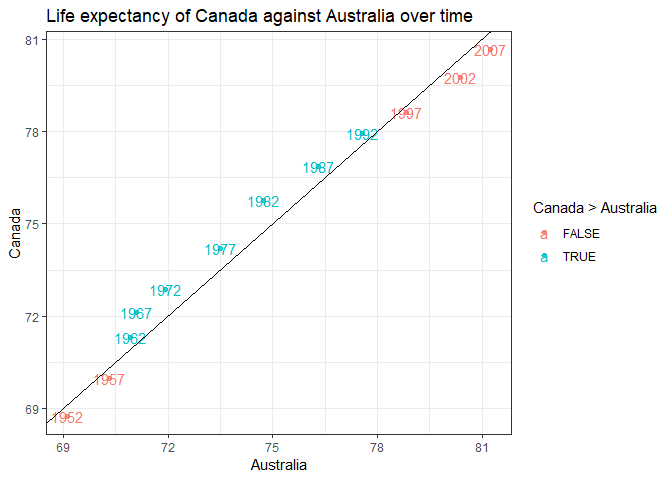
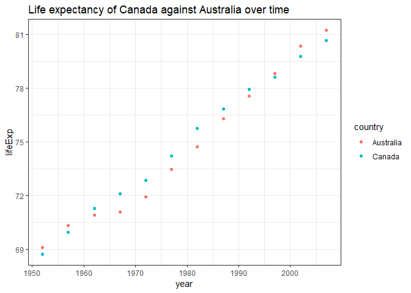
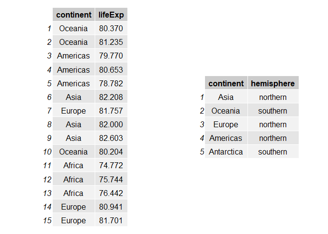

hw04
================

## Introduction

The goal of this homework is to solidify data wrangling skills by
working some realistic problems in the grey area between data
aggregation and data reshaping.

This file is organised by R functions, you could find:

  - Data reshaping(Task 1)
      - [spread](#spread)
      - [gather](#gather)
  - Joins(Task 2)
      - [left\_join](#left_join)
      - [right\_join](#right_join)
      - [inner\_join](#inner_join)
      - [full\_join](#full_join)
      - [semi\_join](#semi_join)
      - [anti\_join](#anti_join)
      - [merge](#merge)
      - [match](#match)

Let’s start with loading the libraries.

``` r
suppressPackageStartupMessages(library(gapminder))
suppressPackageStartupMessages(library(tidyverse))
```

## Data Reshaping(and relationship to aggregation)

### SPREAD

> Spread a key-value pair across multiple columns.

This is the activity 2 of the first task:

> Make a tibble with one row per year and columns for life expectancy
> for two or more countries.
> 
>   - Use knitr::kable() to make this table look pretty in your rendered
>     homework.
> 
>   - Take advantage of this new data shape to scatterplot life
>     expectancy for one country against that of another.

In terms of the description, Canada and Australia are selected and
compared here.

``` r
df <- gapminder %>% 
  select(year, country, lifeExp) %>% 
  filter(country %in% c("Canada", "Australia")) %>%  # filter the data from both Canada and Australia
  spread(country, lifeExp) # spread the selected countries as columns

knitr::kable(df, caption = 'Life Expectancy by Year', digits = 2)
```

| year | Australia | Canada |
| ---: | --------: | -----: |
| 1952 |     69.12 |  68.75 |
| 1957 |     70.33 |  69.96 |
| 1962 |     70.93 |  71.30 |
| 1967 |     71.10 |  72.13 |
| 1972 |     71.93 |  72.88 |
| 1977 |     73.49 |  74.21 |
| 1982 |     74.74 |  75.76 |
| 1987 |     76.32 |  76.86 |
| 1992 |     77.56 |  77.95 |
| 1997 |     78.83 |  78.61 |
| 2002 |     80.37 |  79.77 |
| 2007 |     81.23 |  80.65 |

Life Expectancy by Year

The new data shape is better for a scatterplot with the life expectancy
of two countries since they are in the seperate columns now.

``` r
df %>% 
  ggplot(aes(x = Australia, y = Canada, color = Canada>Australia)) + # colored by comparison
  geom_point(alpha = 0.8) +
  geom_text(aes(label=year)) + # show the corresponding years of the points
  theme_bw() +
  geom_abline(slope = 1) + # add a reference line
  ggtitle("Life expectancy of Canada against Australia over time")
```

<!-- -->

To make the comparison clear, I used two diffenent colors and a
reference line with the slope equals to 1. We could see that the life
expectancy of two countries are very similar and Canada is a bit ahead
in the history overall.

### GATHER

> Gather takes multiple columns and collapses into key-value pairs,
> duplicating all other columns as needed.

Use the `df` from the above section to show how `gather`
works.

``` r
df <- gather(df, country, lifeExp, -c(year)) # gather Canada and Australia

knitr::kable(df)
```

| year | country   | lifeExp |
| ---: | :-------- | ------: |
| 1952 | Australia |  69.120 |
| 1957 | Australia |  70.330 |
| 1962 | Australia |  70.930 |
| 1967 | Australia |  71.100 |
| 1972 | Australia |  71.930 |
| 1977 | Australia |  73.490 |
| 1982 | Australia |  74.740 |
| 1987 | Australia |  76.320 |
| 1992 | Australia |  77.560 |
| 1997 | Australia |  78.830 |
| 2002 | Australia |  80.370 |
| 2007 | Australia |  81.235 |
| 1952 | Canada    |  68.750 |
| 1957 | Canada    |  69.960 |
| 1962 | Canada    |  71.300 |
| 1967 | Canada    |  72.130 |
| 1972 | Canada    |  72.880 |
| 1977 | Canada    |  74.210 |
| 1982 | Canada    |  75.760 |
| 1987 | Canada    |  76.860 |
| 1992 | Canada    |  77.950 |
| 1997 | Canada    |  78.610 |
| 2002 | Canada    |  79.770 |
| 2007 | Canada    |  80.653 |

With our new data shape, it’s good to show how they spread respectively.

``` r
df %>% 
  ggplot(aes(x = year, y = lifeExp, color = country)) +
  geom_point() + 
  theme_bw() +
  ggtitle("Life expectancy of Canada against Australia over time")
```

<!-- -->

## Join Prompts (join, merge, look up)

Create two data sources `my_gap` and `df` first. One is part of the
`gapminder`, top 3 lifeExp of each continent. The other is consists of
continent and hemisphere.

``` r
df <- tibble(
  continent = c("Asia", "Oceania", "Europe", "Americas", "Antarctica"),
  hemisphere = c("northern", "southern", "northern", "northern","southern")
)
my_gap <- gapminder %>% 
  group_by(continent) %>% 
  top_n(3, lifeExp) %>%  
  select(continent, lifeExp)
```

Two tables are shown as follow:

``` r
suppressPackageStartupMessages(library(gridExtra))
grid.arrange(tableGrob(my_gap), tableGrob(df), ncol = 2)
```

<!-- -->

### LEFT\_JOIN

> left\_join(x, y): Return all rows from x, and all columns from x and
> y. If there are multiple matches between x and y, all combination of
> the matches are returned. This is a mutating
    join.

``` r
knitr::kable(left_join(my_gap, df))
```

    ## Joining, by = "continent"

    ## Warning: Column `continent` joining factor and character vector, coercing
    ## into character vector

| continent | lifeExp | hemisphere |
| :-------- | ------: | :--------- |
| Oceania   |  80.370 | southern   |
| Oceania   |  81.235 | southern   |
| Americas  |  79.770 | northern   |
| Americas  |  80.653 | northern   |
| Americas  |  78.782 | northern   |
| Asia      |  82.208 | northern   |
| Europe    |  81.757 | northern   |
| Asia      |  82.000 | northern   |
| Asia      |  82.603 | northern   |
| Oceania   |  80.204 | southern   |
| Africa    |  74.772 | NA         |
| Africa    |  75.744 | NA         |
| Africa    |  76.442 | NA         |
| Europe    |  80.941 | northern   |
| Europe    |  81.701 | northern   |

Africa doesn’t appear in `df`, so it has an `NA` for `hemisphere`.

### RIGHT\_JOIN

> right\_join(x, y): Return all rows from y, and all columns from x and
> y. If there are multiple matches between x and y, all combination of
> the matches are returned. This is a mutating
    join.

``` r
knitr::kable(right_join(my_gap, df))
```

    ## Joining, by = "continent"

    ## Warning: Column `continent` joining factor and character vector, coercing
    ## into character vector

| continent  | lifeExp | hemisphere |
| :--------- | ------: | :--------- |
| Asia       |  82.208 | northern   |
| Asia       |  82.000 | northern   |
| Asia       |  82.603 | northern   |
| Oceania    |  80.370 | southern   |
| Oceania    |  81.235 | southern   |
| Oceania    |  80.204 | southern   |
| Europe     |  81.757 | northern   |
| Europe     |  80.941 | northern   |
| Europe     |  81.701 | northern   |
| Americas   |  79.770 | northern   |
| Americas   |  80.653 | northern   |
| Americas   |  78.782 | northern   |
| Antarctica |      NA | southern   |

Antarctica doesn’t appear in `my_gap`, so it has an `NA` for `lifeExp`.

### INNER\_JOIN

> inner\_join(x, y): Return all rows from x where there are matching
> values in y, and all columns from x and y. If there are multiple
> matches between x and y, all combination of the matches are returned.
> This is a mutating
    join.

``` r
knitr::kable(inner_join(my_gap, df))
```

    ## Joining, by = "continent"

    ## Warning: Column `continent` joining factor and character vector, coercing
    ## into character vector

| continent | lifeExp | hemisphere |
| :-------- | ------: | :--------- |
| Oceania   |  80.370 | southern   |
| Oceania   |  81.235 | southern   |
| Americas  |  79.770 | northern   |
| Americas  |  80.653 | northern   |
| Americas  |  78.782 | northern   |
| Asia      |  82.208 | northern   |
| Europe    |  81.757 | northern   |
| Asia      |  82.000 | northern   |
| Asia      |  82.603 | northern   |
| Oceania   |  80.204 | southern   |
| Europe    |  80.941 | northern   |
| Europe    |  81.701 | northern   |

According to the matching values from two dataframes, both Antarctica
and Africa don’t appear in the table.

### FULL\_JOIN

> full\_join(x, y): Return all rows and all columns from both x and y.
> Where there are not matching values, returns NA for the one missing.
> This is a mutating
    join.

``` r
knitr::kable(full_join(my_gap, df))
```

    ## Joining, by = "continent"

    ## Warning: Column `continent` joining factor and character vector, coercing
    ## into character vector

| continent  | lifeExp | hemisphere |
| :--------- | ------: | :--------- |
| Oceania    |  80.370 | southern   |
| Oceania    |  81.235 | southern   |
| Americas   |  79.770 | northern   |
| Americas   |  80.653 | northern   |
| Americas   |  78.782 | northern   |
| Asia       |  82.208 | northern   |
| Europe     |  81.757 | northern   |
| Asia       |  82.000 | northern   |
| Asia       |  82.603 | northern   |
| Oceania    |  80.204 | southern   |
| Africa     |  74.772 | NA         |
| Africa     |  75.744 | NA         |
| Africa     |  76.442 | NA         |
| Europe     |  80.941 | northern   |
| Europe     |  81.701 | northern   |
| Antarctica |      NA | southern   |

All continents appear in the table since full\_join doesn’t match
values.

### SEMI\_JOIN

> semi\_join(x, y): Return all rows from x where there are matching
> values in y, keeping just columns from x. A semi join differs from an
> inner join because an inner join will return one row of x for each
> matching row of y, where a semi join will never duplicate rows of x.
> This is a filtering
    join.

``` r
knitr::kable(semi_join(my_gap, df))
```

    ## Joining, by = "continent"

    ## Warning: Column `continent` joining factor and character vector, coercing
    ## into character vector

| continent | lifeExp |
| :-------- | ------: |
| Oceania   |  80.370 |
| Oceania   |  81.235 |
| Americas  |  79.770 |
| Americas  |  80.653 |
| Americas  |  78.782 |
| Asia      |  82.208 |
| Europe    |  81.757 |
| Asia      |  82.000 |
| Asia      |  82.603 |
| Oceania   |  80.204 |
| Europe    |  80.941 |
| Europe    |  81.701 |

The rows of `semi_join` is the same with that of `inner_join`. But there
is not “hemisphere” since it just keeps the columns from `my_gap`.

### ANTI\_JOIN

> anti\_join(x, y): Return all rows from x where there are not matching
> values in y, keeping just columns from x. This is a filtering
    join.

``` r
knitr::kable(anti_join(my_gap, df))
```

    ## Joining, by = "continent"

    ## Warning: Column `continent` joining factor and character vector, coercing
    ## into character vector

| continent | lifeExp |
| :-------- | ------: |
| Africa    |  74.772 |
| Africa    |  75.744 |
| Africa    |  76.442 |

It can be considered as`my_gap` deduct the output of `semi_join` above.

### MERGE

`merge` is a base R function and mainly based on SQL joins. In this
section I would compare it with `dplyr` joins.

Both `merge` and `dplyr` joins could implemente different kinds of
joins. The main difference between them is the intuitive syntax. As
shown above, there are separate functions for each type of join in
`dplyr`, whereas `merge` function differentiate them by arguments.

In the following examples, I would show how to make joins with `merge`.

  - `left_join`

<!-- end list -->

``` r
knitr::kable(merge(my_gap, df, all.y = TRUE))
```

| continent  | lifeExp | hemisphere |
| :--------- | ------: | :--------- |
| Americas   |  79.770 | northern   |
| Americas   |  80.653 | northern   |
| Americas   |  78.782 | northern   |
| Asia       |  82.208 | northern   |
| Asia       |  82.000 | northern   |
| Asia       |  82.603 | northern   |
| Europe     |  81.757 | northern   |
| Europe     |  80.941 | northern   |
| Europe     |  81.701 | northern   |
| Oceania    |  81.235 | southern   |
| Oceania    |  80.370 | southern   |
| Oceania    |  80.204 | southern   |
| Antarctica |      NA | southern   |

  - `right_join`

<!-- end list -->

``` r
knitr::kable(merge(my_gap, df, all.y = TRUE))
```

| continent  | lifeExp | hemisphere |
| :--------- | ------: | :--------- |
| Americas   |  79.770 | northern   |
| Americas   |  80.653 | northern   |
| Americas   |  78.782 | northern   |
| Asia       |  82.208 | northern   |
| Asia       |  82.000 | northern   |
| Asia       |  82.603 | northern   |
| Europe     |  81.757 | northern   |
| Europe     |  80.941 | northern   |
| Europe     |  81.701 | northern   |
| Oceania    |  81.235 | southern   |
| Oceania    |  80.370 | southern   |
| Oceania    |  80.204 | southern   |
| Antarctica |      NA | southern   |

  - `full_join`

<!-- end list -->

``` r
knitr::kable(merge(my_gap, df, all = TRUE))
```

| continent  | lifeExp | hemisphere |
| :--------- | ------: | :--------- |
| Africa     |  76.442 | NA         |
| Africa     |  74.772 | NA         |
| Africa     |  75.744 | NA         |
| Americas   |  79.770 | northern   |
| Americas   |  80.653 | northern   |
| Americas   |  78.782 | northern   |
| Asia       |  82.208 | northern   |
| Asia       |  82.000 | northern   |
| Asia       |  82.603 | northern   |
| Europe     |  81.757 | northern   |
| Europe     |  80.941 | northern   |
| Europe     |  81.701 | northern   |
| Oceania    |  81.235 | southern   |
| Oceania    |  80.370 | southern   |
| Oceania    |  80.204 | southern   |
| Antarctica |      NA | southern   |

\-`inner_join`

``` r
knitr::kable(merge(my_gap, df))
```

| continent | lifeExp | hemisphere |
| :-------- | ------: | :--------- |
| Americas  |  79.770 | northern   |
| Americas  |  80.653 | northern   |
| Americas  |  78.782 | northern   |
| Asia      |  82.208 | northern   |
| Asia      |  82.000 | northern   |
| Asia      |  82.603 | northern   |
| Europe    |  81.757 | northern   |
| Europe    |  80.941 | northern   |
| Europe    |  81.701 | northern   |
| Oceania   |  81.235 | southern   |
| Oceania   |  80.370 | southern   |
| Oceania   |  80.204 | southern   |

All the outputs are the same with those of `dplyr` joins except the row
order. It’s worth mentioning that row order is guaranteed to be
preserved in `dylyr` joins.

### MATCH

`Match` returns a vector of the positions of (first) matches of its
first argument in its second. It does not perform any data join, but I
would make a simple example to show how it works in an indirect
way.

``` r
pos <- match(df$continent, my_gap$continent) # the vector of the positions in my_gap
knitr::kable(my_gap[pos,])
```

| continent | lifeExp |
| :-------- | ------: |
| Asia      |  82.208 |
| Oceania   |  80.370 |
| Europe    |  81.757 |
| Americas  |  79.770 |
| NA        |      NA |

From the matched positions, we could find the continents which appear in
both `df` and `my_gap`.
